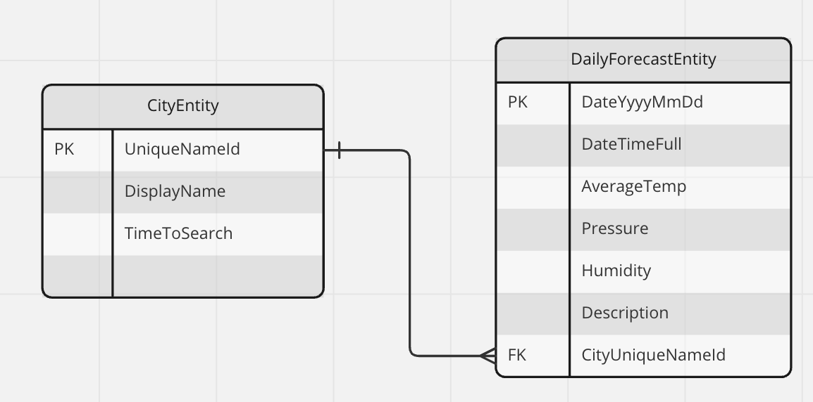

## Simple Weather app
- The Android app to display 7 days weather forecast in a ListView.
- Written in Kotlin.
- Follow the Clean Architecture (Data - Domain - Presentation layers) with MVVM.
- Weather data source: OpenWeatherMaps API.
- Allow user to input the searching term (from 3 characters).
- Caching mechanism: offline first (with cache expiry is 10 seconds in Debug mode, and 60 seconds in Release mode), then online later.
- Support orientation change: keep the current search term & forecast result after rotating screen.
- Error handling: Network issue (no network, timeout), Invalid city keyword, Invalid API key or exceed quota, When searching term is less than 3 characters.
- Support the disability to scale large text.
- Support the disability to read out the text using TalkBack controls.

## TechStack
### Languages
- Kotlin
- Groovy: Gradle (`build.gradle`)
- YAML: Gradle Version Catalogs (`libs.version.toml`), Detekt (`detekt.yml`)

### Libraries
- Jetpack: LiveData, ViewModel, Lifecycle, Room, ViewBinding
- Material Design, ConstraintLayout
- Coroutines & Flow
- Dagger Hilt
- Retrofit, OkHttp, Gson.
- [hidden-secrets-gradle-plugin](https://github.com/klaxit/hidden-secrets-gradle-plugin) to hide the API key in the `.so` native lib.

### Testing, formatting & analysis
- [Detekt](https://github.com/detekt/detekt/) (static code analysis for Kotlin).
- [Spotless](https://github.com/diffplug/spotless) (code formatting with Ktlint built-in support).
- [Android Lint](https://developer.android.com/studio/write/lint).
- Unit test: [MockK](https://github.com/mockk/mockk), [Robolectric](https://github.com/robolectric/robolectric), JUnit, [Turbine](https://github.com/cashapp/turbine), [MockWebServer](https://github.com/square/okhttp/tree/master/mockwebserver), [AndroidX test](https://github.com/android/android-test).
- UI (Instrumented test): [AndroidX test](https://github.com/android/android-test), [Espresso](https://developer.android.com/training/testing/espresso).

## How to build & run
- Requires tools/SDK: Android Studio Dolphin | 2021.3.1, Android SDK API level 33 & NDK, Java 11.
- To run the Detekt (static code analysis): `./gradlew detekt`.
- To view all the Spotless (code formatting) errors/warning: `./gradlew spotlessCheck`.
- To apply the Spotless fix automatically: `./gradlew spotlessApply`.
- To run Android Lint: `./gradlew app:lintDebug`.
- To run unit test: `./gradlew testDebugUnitTest`.
- To run instrumented test: `./gradlew connectedAndroidTest`.

## Project structure & diagram
### Structure
| com.bmtriet.simpleweather

|---- data

|---- ---- local

|---- ---- ----- dao

|---- ---- ----- datasource

|---- ---- ----- entity

|---- ---- mapper

|---- ---- network

|---- ---- ----- datasource

|---- ---- ----- error

|---- ---- ----- interceptor

|---- ---- ----- response

|---- ---- ----- service

|---- ---- repository

|---- di

|---- domain

|---- ---- model

|---- ---- reposity-interface

|---- ---- usecase

|---- presentation

|---- ---- UI model

|---- ---- adapter + viewholder

|---- ---- home (Activity + Fragment + ViewModel)

|---- utils

### Diagram

## Checklist
- [x] Clean Architecture with MVVM.
- [x] Show the Weather Forecast in the ListView. Error handling as well as caching handling.
- [x] Secure the OpenWeatherMap API key (inside `.so`). There is no perfect solution to hide API key on the app side.
- [x] Testing: Unit + Instrumented.
- [x] Static code analysis.
- [x] Support accessibility (screen reader) with TalkBack
- [x] Support accessibility with TalkBack

## Remaing things to do
Due to time constraint, I cannot finish these thing. It would be the improvement later.
- [ ] Setup CI/CI workflow.
- [ ] Modularization (at least 4 modules: `data`, `domain`, `presentation`, `utils`).
- [ ] Try the Jetpack Compose as the replacement of XML layout.
